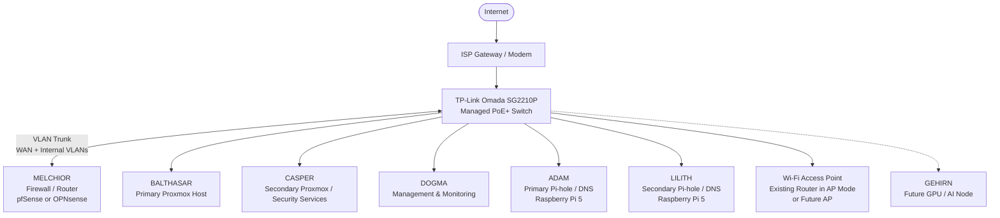

# MAGI Initial Architecture

This document represents the current high-level architecture for the MAGI
Infrastructure project.

It shows the planned physical and logical relationships between the major MAGI
systems before detailed VLAN IDs, IP addressing, firewall rules, and trust
boundaries are finalized.

## Physical Architecture

## Router-on-a-Stick Design

MELCHIOR has one onboard Ethernet interface and will therefore use a
router-on-a-stick architecture.

The SG2210P port connected to MELCHIOR will operate as a VLAN trunk. Multiple
logical networks will share this single physical Ethernet connection while
remaining separated through IEEE 802.1Q VLAN tagging.

The ISP gateway will connect to a switch port assigned to a dedicated WAN-side
network.

MELCHIOR will use separate logical firewall interfaces for the WAN-side network
and the internal MAGI VLANs.

Traffic moving between the WAN-side network and internal MAGI networks must be
processed by MELCHIOR's firewall and routing functions.

The exact VLAN IDs, private IPv4 subnets, and interface assignments are
intentionally not defined in this document. Those values will be developed
during the preliminary IP and VLAN design.

## Central Switching

The TP-Link Omada SG2210P will act as the central managed switch for MAGI.

The switch will provide:

- Physical Ethernet connectivity for MAGI systems
- VLAN segmentation
- VLAN trunking
- Port-based VLAN assignment
- PoE+ for compatible devices
- Network monitoring
- Future port-mirroring capabilities
- Connectivity between physical systems and virtualized infrastructure

The SG2210P will also provide the VLAN trunk required by MELCHIOR's
router-on-a-stick design.

ADAM and LILITH are planned to receive both network connectivity and electrical
power through the SG2210P using combined PoE+ / NVMe HATs.

## Virtualization Architecture

BALTHASAR and CASPER will provide the primary virtualization capacity for MAGI
using Proxmox VE.

BALTHASAR is planned as the primary Proxmox virtualization host.

CASPER is planned as a secondary virtualization host with additional emphasis
on security-related infrastructure and services.

Virtual machines hosted on BALTHASAR and CASPER may include:

- Windows Server infrastructure
- Directory services
- Security monitoring systems
- SIEM services
- Linux infrastructure servers
- Administrative services
- Security testing systems
- Intentionally vulnerable testing targets

Proxmox virtual network bridges will connect virtual machines to the physical
MAGI network.

As the VLAN design is implemented, selected Proxmox connections may operate as
VLAN trunks so virtual machines on different logical networks can share the
host's single physical Ethernet interface.

## Management and Monitoring

DOGMA will act as the dedicated lightweight management and monitoring node.

Possible responsibilities include:

- Secure administrative access
- SSH management
- Network and system health checks
- SNMP monitoring
- Lightweight dashboards
- Small administrative scripts
- Automation support

DOGMA is not intended to host resource-intensive SIEM or security-analysis
workloads.

Heavier security and monitoring services will instead be hosted on systems
with greater CPU, memory, and storage capacity, such as virtual machines on
BALTHASAR or CASPER.

## DNS Infrastructure

ADAM and LILITH will provide redundant Pi-hole and DNS services.

ADAM will act as the primary DNS node.

LILITH will act as the secondary DNS node so DNS services can remain available
when ADAM is offline or undergoing maintenance.

Both systems are Raspberry Pi 5 devices with 16 GB of memory and Active
Coolers.

Combined PoE+ / NVMe HATs are planned so the Raspberry Pi systems can receive
electrical power through their Ethernet connections while retaining the option
to add NVMe storage later.

The systems can initially operate using microSD storage without NVMe drives.

## Security Monitoring

MAGI is intended to collect and analyze security information from multiple
systems and network segments.

Future monitoring may include:

- Firewall events
- Authentication activity
- Windows security logs
- Linux logs
- Proxmox events
- DNS activity
- IDS/IPS alerts
- Network traffic observations
- Security-testing activity

A SIEM or centralized monitoring platform may be deployed within the
virtualized infrastructure.

The managed switch may also use port mirroring later to provide traffic
visibility to a dedicated monitoring or sensor system.

## Security Testing

MAGI will include an isolated security-testing environment.

This environment may contain:

- Penetration-testing virtual machines
- Intentionally vulnerable systems
- Controlled attack simulations
- Detection-testing targets

Testing networks should remain isolated from unrelated infrastructure and
management systems unless specific communication is intentionally allowed.

Firewall rules and VLAN boundaries will be used to control access between
testing systems and the rest of MAGI.

## Remote Administration

Remote access to MAGI should use a secure administrative path.

Internal management interfaces should not be exposed directly to the public
Internet.

A VPN-based approach is preferred so administrators can authenticate through
the MAGI firewall before accessing internal systems.

The final remote-access configuration will be determined after the firewall
platform and network segmentation design are finalized.

## Future AI Integration

GEHIRN is planned as a future GPU and AI node.

The system is expected to reuse an NVIDIA RTX 3080 Ti and provide local
AI-assisted functionality for MAGI.

Possible uses include:

- Security alert summarization
- Log analysis
- Event correlation assistance
- Investigation recommendations
- Incident-report drafting
- Administrative assistance

Initial AI functionality will remain advisory.

Significant firewall, security, or infrastructure changes will continue to
require administrator approval.

## System Roles

- **MELCHIOR** — Firewall / router
- **BALTHASAR** — Primary Proxmox virtualization host
- **CASPER** — Secondary Proxmox virtualization / security-services host
- **DOGMA** — Dedicated management and monitoring node
- **ADAM** — Primary Pi-hole / DNS node
- **LILITH** — Secondary Pi-hole / DNS node
- **TP-Link Omada SG2210P** — Central managed PoE+ switch
- **GEHIRN** — Future GPU / AI node

## Architecture Notes

- MELCHIOR replaces the previously planned dedicated multi-NIC firewall
  appliance.
- MELCHIOR's single onboard Ethernet interface requires a router-on-a-stick
  design.
- WAN and internal MAGI networks will remain logically separated using VLANs
  even though they share the SG2210P and MELCHIOR's physical Ethernet link.
- BALTHASAR and CASPER remain the primary virtualization systems.
- Proxmox virtual bridges will connect virtual machines to the MAGI network.
- DOGMA provides lightweight administrative and monitoring functions.
- ADAM and LILITH provide redundant DNS services and are planned to receive
  power through PoE+.
- The SG2210P provides the central physical switching and VLAN infrastructure.
- Security-testing systems will be isolated from unrelated infrastructure.
- Remote administration will use a secure method such as VPN access rather
  than directly exposing management interfaces.
- Detailed VLAN IDs, private IPv4 subnets, gateway addresses, switch-port
  assignments, firewall rules, and trust boundaries will be defined during the
  preliminary IP and VLAN design.
  