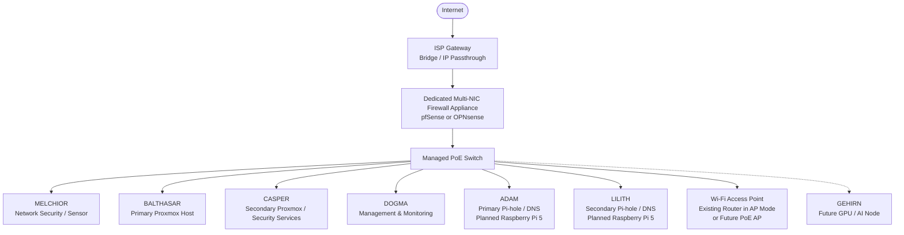

# MAGI Initial Architecture

This document represents the initial high-level architecture for the MAGI
Infrastructure project. It shows how the major physical systems are planned to
connect before detailed VLANs, IP addressing, and trust boundaries are defined.

## Architecture Notes

- The ISP gateway will use bridge or IP passthrough mode where supported so
  that the MAGI firewall can handle routing and firewall functions.
- A dedicated multi-NIC appliance is planned for pfSense or OPNsense so that
  WAN and LAN traffic can use separate physical interfaces.
- The managed PoE switch will serve as the central network connection point
  and will later support VLAN segmentation, trunking, monitoring, and PoE
  devices.
- MELCHIOR is planned as a network security and sensor node.
- BALTHASAR and CASPER are planned as the main Proxmox virtualization systems.
- DOGMA is planned as a dedicated management and monitoring node.
- ADAM and LILITH are planned Raspberry Pi 5 systems providing primary and
  secondary Pi-hole/DNS services.
- GEHIRN is a future GPU-based AI node intended for local AI-assisted security
  and administrative tasks.
- Detailed VLANs, IP addressing, and trust boundaries will be developed in the
  next design stage.
